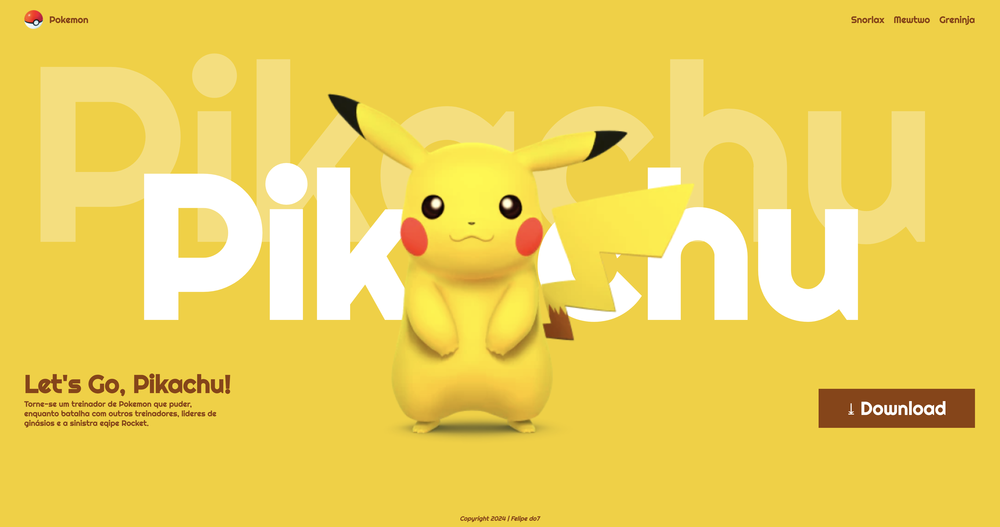

# Landing page - Let's Go, Pikachu

## Sobre 
para divulgar o jogo Let's Go, Pikachu.
O intuito deste projeto é colocar em prática o conhecimento adquirido sobre as linguagens de marcação, HTML, CSS e Markdown, realizadas no curso técnico de desenvolvimento de sistemas [SENAI JANDIRA](https://sp.senai.br/unidade/jandira/)

## Tecnologias utilizadas
- HTML
- CSS
- Markdown
- Git

## Autor
- [Felipe Vieira](https://www.linkedin.com/in/felipe-vieira-363074327/)